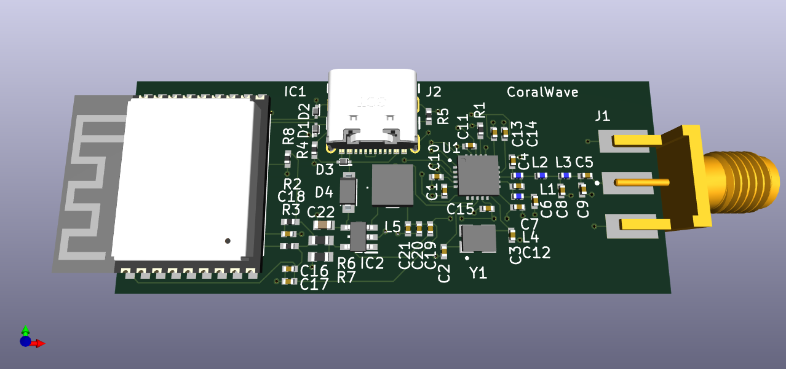

# CoralWave

This repository contains the hardware design files for an RF transceiver system built using an ESP32-C3 module and a CC1101 RF chip. The communication between the ESP32-C3 and CC1101 is established through the Serial Peripheral Interface (SPI) protocol. The design is created using KiCad 7.



## Abstract

The project aims to create a versatile RF communication system by integrating the ESP32-C3 module and the CC1101 RF chip. The ESP32-C3 serves as the main controller, handling data processing and interfacing with external devices, while the CC1101 handles the RF communication with other compatible devices. This design allows for bi-directional communication over a designated RF frequency band, making it suitable for various applications such as replacing remote controls.

**Note:** The design around the CC1101 chip is tuned for the 315/433 MHz ISM/SRD frequency bands. (See the documentation of the [CC1101](https://www.ti.com/lit/ds/symlink/cc1101.pdf) chip for more information.)

## Opening the Design

Follow these steps to open the hardware design using KiCad 7:

1. Clone this repository to your local machine using the following command:

   ```
   git clone https://github.com/mineiwik/CoralWave.git
   ```

2. Launch KiCad 7.

3. Open the KiCad project by navigating to the project directory and locating the `.kicad_pro` file. This file stores the project information.

4. Once the project is open, you can access the schematic and PCB layout files by clicking on the respective buttons in the KiCad project manager.

5. Adjust the design and/or export the gerbel files for PCB production

## Design Files

The repository contains the following design files:

- Schematic files (`.kicad_sch`) - These files define the circuit connections and component values.
- PCB layout files (`.kicad_pcb`) - These files represent the physical arrangement of components on the PCB.
- Component libraries (see the `PCBLib` submodule) - Custom libraries that include footprints and symbols for the ESP32-C3, CC1101, and other components used in the design.
